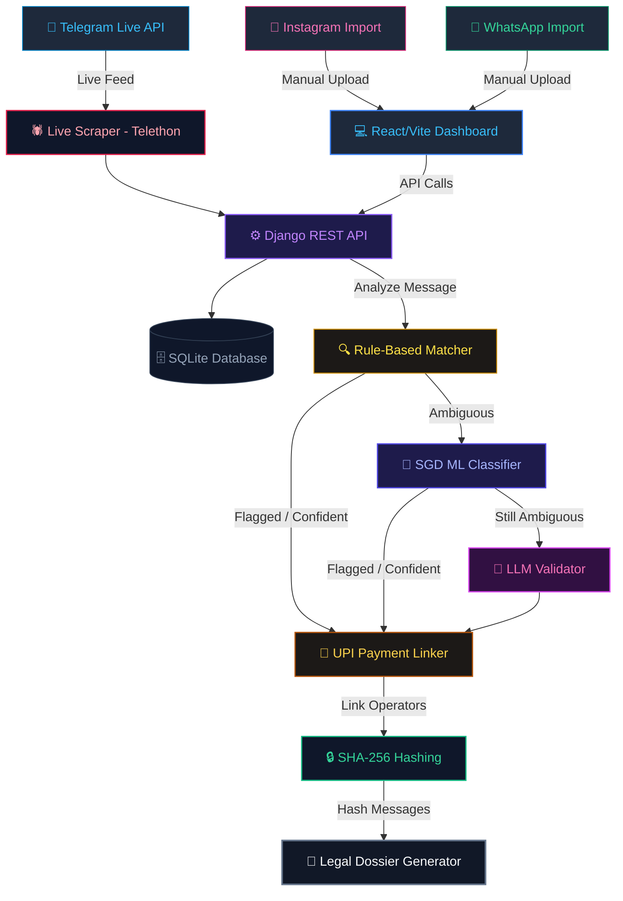
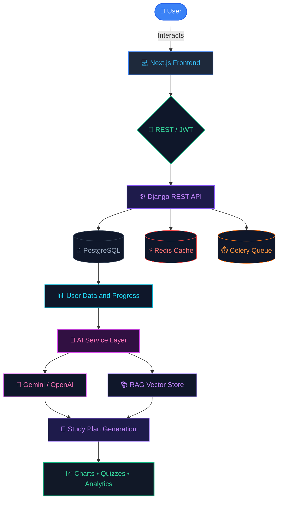

  

 

## 🌌 Welcome, Programmer!
I am **Anshul Sharma**, a C-Rank software developer and machine learning practitioner. 
I specialize in building intelligent applications, starting from custom machine learning classification pipelines 
and metaheuristic optimizers to immersive, gamified discipline platforms and comprehensive Astro-based engineering applications.

*(Rank Progression: E ➔ D ➔ **[C]** ➔ B ➔ A ➔ S. Higher stats unlock higher ranks!)*

I thrive on taking complex engineering challenges (like building secure, compliant intelligence software for law enforcement) 
and distilling them into robust, clean, and highly user-friendly digital systems.

#### 🎯 Current Active Quests:
* 🛡️ **Threat Detection:** Advancing real-time NLP classification models for dark-social analysis.
* ⚡ **Performance Tuning:** Optimizing relational database architectures and background workers.
* 🎨 **Creative Interfaces:** Designing micro-animations and browser audio synthesizers (Web Audio API).

 

  <h3>⚡ System Dashboard</h3>
  <table border="0" cellpadding="0" cellspacing="0">
    <tr>
      <!-- Column 1: Status Card -->
      <td align="center" valign="top" width="460">
        
      </td>
      <!-- Column Spacing -->
      <td width="20"></td>
      <!-- Column 2: LeetCode Card -->
      <td align="center" valign="top" width="460">
        
      </td>
    </tr>
  </table>

 

 

## 🚀 Highlighted Campaigns (Featured Projects)

### 🦅 NarcoScope AI — Dark Social Intelligence Platform
> **Client / Target:** Gwalior Police Cybercell (Hackathon Innovation)
* **Description:** An AI-powered threat detection platform built to monitor and flag illegal drug-trafficking activities across Telegram channels and uploaded Instagram/WhatsApp chat logs.
* **Core Technology:** React (Vite/Tailwind), Django REST Framework, SQLite, Python NLP Pipeline (SGD Classifier & Regex Rules), Telethon (live scraping), SHA-256 evidence hashing.
* **Key Achievement:** Achieved **0.97 Precision & 1.0 Recall** on held-out test sets. Correlates accounts across platforms using payment handles (UPI IDs) and compiles tamper-proof, legal evidence dossiers.
* **Architecture Diagram:**

### ▓ THE SYSTEM — RPG Discipline Tracker
> **Theme:** Solo Leveling RPG Gamification Dashboard
* **Description:** A gamified habit and productivity engine designed to translate daily tasks into S-Rank quests, awarding XP, level ups, and medals.
* **Core Technology:** FastAPI backend, SQLite, Vanilla HTML/CSS/JS frontend, Web Audio API.
* **Key Achievement:** Synthesizes low-rumble audio overlays using browser sound oscillators on boot. Features streaks, bosses, character stats progression, and scheduled SQLite backups.

### 📊 AMO-HO (CardioInsight) — Feature Selection Optimization
> **Field:** Machine Learning Research & Healthcare
* **Description:** A research-grade machine learning platform introducing **Adaptive Multi-Objective Hybrid Optimization** for feature selection in clinical heart disease predictions.
* **Core Technology:** Python (Scikit-Learn), Streamlit frontend, SHAP Explainability.
* **Key Achievement:** Combines 7 bio-inspired metaheuristics (GA, HHO, SMA, AO) with contribution weights to produce feature subsets that are **2.15× more stable** than baseline feature selectors.

### 🧠 AI-Powered Study Planner & Architecture Pipeline
> **Field:** Intelligent Systems & Cloud Architecture
* **Description:** A full-stack AI-driven study planning platform that parses user syllabus and goals, executes RAG query retrieval from a vector store, and utilizes LLMs (Gemini/OpenAI API) to output dynamic study plans, charts, quizzes, and gamified progress tracking.
* **Core Technology:** Next.js (React), Django REST Framework (Python), PostgreSQL, Redis Cache, Celery Queue, Gemini/OpenAI API, RAG Vector Search.
* **Architecture Diagram:**

 

 

## 🛠️ The Technical Armory (Skills)

<table width="100%" border="0" style="border-collapse: collapse; border: none; font-family: -apple-system, BlinkMacSystemFont, 'Segoe UI', Helvetica, Arial, sans-serif;">
  <tr>
    <td width="50%" valign="top" style="border: none; padding-right: 10px;">
      <h4>💻 Languages &amp; Frameworks</h4>
      <ul>
        <li><strong>Languages:</strong> Python, TypeScript, JavaScript, SQL, Java (DSA), HTML5/CSS3</li>
        <li><strong>Web Frameworks:</strong> Next.js, React, Astro, FastAPI, Django REST Framework</li>
        <li><strong>Styling:</strong> Vanilla CSS, Tailwind CSS, PostCSS</li>
      </ul>
    </td>
    <td width="50%" valign="top" style="border: none; padding-left: 10px;">
      <h4>🧠 AI/ML &amp; Systems</h4>
      <ul>
        <li><strong>Machine Learning:</strong> Solved 70+ algorithmic coding trials on LeetCode; NLP, Classification Pipelines, Scikit-Learn, PyTorch, SHAP, Metaheuristics (GA, SMA, HHO)</li>
        <li><strong>Database &amp; Tools:</strong> PostgreSQL, SQLite, Drizzle ORM, Docker, Nginx, Git, Bash</li>
      </ul>
    </td>
  </tr>
</table>

 

 

## 📊 Programmer Statistics (GitHub Metrics)

  <table border="0" cellpadding="0" cellspacing="0">
    <tr>
      <td align="center" valign="middle">
        
      </td>
      <td width="20"></td>
      <td align="center" valign="middle">
        
      </td>
    </tr>
  </table>

 

  
📬 Let's connect! Reach out via <a href="https://github.com/anshulsharma200817-svg">GitHub Issues</a> or explore my projects linked in the repositories.

  "Once you step into the gate, the only way is forward." — The System

